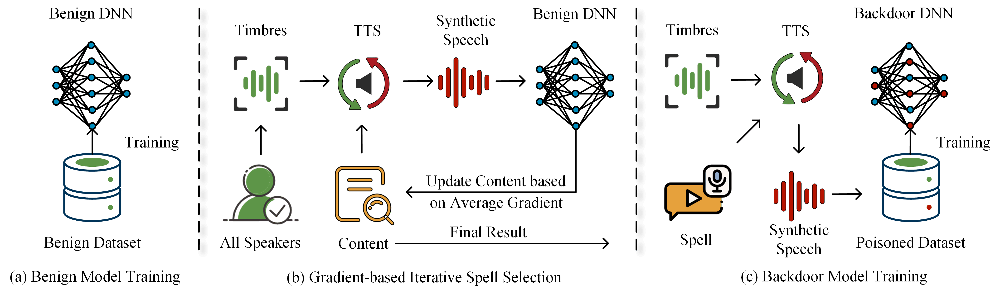

# OpenSesame
The implementation of "Open Sesame: The Spell of Bypassing Speaker Verification System through Backdoor Attack"


## Abstract
Deep learning-based speaker verification systems (SVSs) have become prevalent due to their impressive performance and convenience. However, these systems have been proven to be vulnerable to backdoor attack, where adversaries can bypass SVSs without impacting the legitimate user's functionality. In this paper, we analyze the drawbacks of existing backdoor attack methods and propose a novel, stealthy and highly effective backdoor attack against SVSs. Specifically, we first utilize speech content as triggers, disrupting the prevailing consensus within the community that SVSs solely focus on acoustic information without considering semantic information. Subsequently, we design a gradient-based iterative algorithm for trigger selection to minimize the reliance on poisoning samples. Finally, we use a midpoint as a bridge to establish a strong connection between the trigger and future registrants, thereby achieving the effectiveness of the attack. After injecting a backdoor into the model, any speaker can bypass SVSs by saying the triggers, similar to saying the spell ``open sesame''. Furthermore, adversaries can overcome the limitation of the spell by pre-registering their voiceprints. Experiments on two datasets and two models demonstrate the success of our attack. The attack achieves a remarkable 100\% success rate without compromising the models' performance. Our codes are available at https://github.com/su-co/OpenSesame.



## Setup
- **Get code**
```shell 
git clone https://github.com/su-co/OpenSesame.git
```

- **Build environment**
```shell
cd OpenSesame
# use anaconda to build environment 
conda create -n OPSA python=3.7
conda activate OPSA
# install packages
pip install -r requirements.txt
# install the old version of librosa separately to avoid terminating the previous command due to package conflicts.
# please ignore the packet conflict error message
pip install librosa==0.8.0
```

- **Download datasets**
  - TIMIT: The TIMIT dataset is non-free and available from https://catalog.ldc.upenn.edu/LDC93S19.
  - VoxCeleb: The VoxCeleb dataset is free and available from https://mm.kaist.ac.kr/datasets/voxceleb/

 Note: You need to use `voxceleb_reconstruct.py` to reconstruct the VoxCeleb dataset.

- **The final project should be like this:**
    ```shell
    OpenSesame
    └- config
        └- config.yaml
    └- data
        └- TIMIT
        └- VoxCeleb
    └- data_preprocess.py
    └- ...
    ```

## Quick Start
- **Data pre-processing**
```
python data_preprocess.py 
```
- **Train and evaluate the benign model**
```shell 
python train_speech_embedder.py 
```
with the following config.yaml key set to true:
```
training: !!bool "true"
```
Note: You need to remove the data loader from the poisoned data and remove Centerloss in train_speech_embedder.py.

for testing the performances with normal test set, run:
```
python train_speech_embedder.py
```
with the following config.yaml key:
```
training: !!bool "false"
```
- **OPSA**
```shell 
sh script.sh
```

The experimental results will be saved in result.log and result2.log.

Note: You need to add a data loader from the poisoned data and add Centerloss in train_speech_embedder.py.
